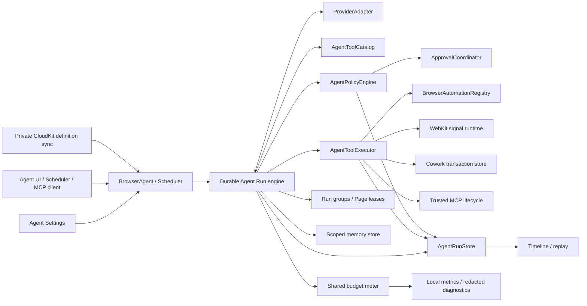
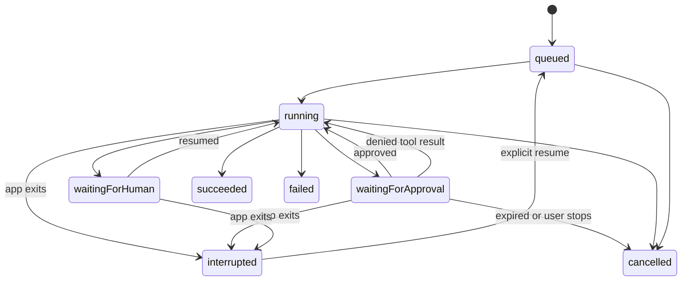

# AI tooling architecture

## Domain language

Use these names consistently in code, storage, UI, and protocol documentation:

| Name | Meaning | Must not mean |
|---|---|---|
| `BrowserSession` | Existing website-data isolation container: normal, persistent container, or incognito | An AI conversation, model request, or MCP connection |
| `Tab` | Existing browsing unit that owns a live or restorable WebKit page | A model message |
| `PageHandle` | Automation address for a Tab, currently `windowUUID:tabUUID` | A separate headless browser context |
| `AgentConversation` | User-visible thread containing prompts and run references | Browsing-data isolation |
| `AgentRun` | One bounded execution of a prompt | A long-lived conversation |
| `AgentStep` | One model response, tool invocation/result, approval, handoff, or system event | A raw UI message only |
| `AgentTaskDefinition` | Reusable scheduled prompt and execution policy | A particular scheduled run |
| `MCPConnection` | Configuration and trust state for one external MCP endpoint | A browser Session |
| `AgentRunGroup` | Parent execution coordinating bounded child runs | A TabGroup or Split |
| `PageLease` | Read/shared or mutation/exclusive authority over one Page for one Run | Tab ownership or window focus |
| `CoworkTransaction` | Staged, previewable local-file changes awaiting commit | A shell or direct arbitrary file access |
| `AgentMemoryEntry` | Reviewable fact/preference with provenance, sensitivity, expiry, and scope | Browsing history or hidden model state |

A hidden or background Page remains a normal Tab. A Split remains per-window
view state. An AgentRun may address several Tabs, but it does not own their
website-data store.

## Target component boundaries



The boundaries are implemented as Foundation contracts, actors, and main-actor
runtime adapters rather than separate frameworks. They prevent duplicate tool
schemas, entry-point-specific permission checks, provider payload leakage,
fragmented evidence, Page races, and unmetered child work.

### Coordinator and run engine

`BrowserAgent` and `AgentScheduledTaskEngine` create conversations and Runs,
snapshot effective configuration, consume normalized provider events, request
policy before effects, append Steps, reconcile the shared meter, and propagate
cancellation. Persistence and policy contracts remain independent of
`WKWebView`, Keychain, SwiftUI, and vendor JSON formats.

### `ProviderAdapter`

Converts a normalized request into provider-specific network traffic and emits
an asynchronous stream of text deltas, tool-call deltas, usage, warnings, and a
terminal event. The implemented parsers/builders cover OpenAI-compatible Chat
Completions, OpenAI Responses, Anthropic Messages, and Gemini generateContent.
Adapters declare capabilities such as parallel tool calls, image input,
structured output, and usage reporting; missing usage remains unknown.

### `AgentToolCatalog`

Is the source of truth for stable tool name, semantic version, description,
input/output JSON Schemas, required static capabilities, risk class, origin,
route, visibility profiles, and compatibility aliases. MCP `tools/list` and
built-in model definitions are renderings of the same descriptors. The public
BrowserOS MCP profile is pinned to exactly 53 names; native-only tools are
selected through another visibility profile.

The catalogue contains metadata only and must compile without AppKit, SwiftUI,
or WebKit so the app and `browser-cli` helper can share it.

### `AgentPolicyEngine`

Combines the tool's declared risk with invocation context: attended versus
scheduled, target origin, browser Session type, file path, external MCP server,
and whether data leaves the browser. It returns allow, deny, or require-human
approval. The executor cannot bypass it.

### `AgentToolExecutor`

Dispatches an approved invocation to one of the implementation families:

- browser automation against `BrowserAutomationRegistry` and live Tabs;
- staged file operations within the selected Cowork root;
- dynamic tools through a specific trusted `MCPConnection`;
- Run Group delegation, memory, and bounded WebKit signal observation.

It returns structured content, artifacts, observations, and a normalized error.
It never manufactures an approval.

### `AgentRunStore`

Appends immutable steps and stores small mutable indexes separately. It powers
conversation history, recovery, replay, scheduler results, and diagnostic
export. Payload redaction happens before durable storage.

### MCP trust and native OAuth

An MCP connection binds its normalized secure endpoint, negotiated
protocol/capabilities, server identity, tool-schema digest, auth mode and
effective scopes into a trust generation. A change invalidates prior grants.
Bearer and OAuth material live in device-only Keychain records; persisted
connection records remain secret-free.

OAuth uses standards discovery, authorization code with S256 PKCE, the system
`ASWebAuthenticationSession`, and a one-shot `NWListener` bound only to
`127.0.0.1` on an OS-assigned port. The callback validates method, path, Host,
port, state, size, and timeout before code exchange. The public native client ID
must be pre-registered with the server; Browser does not operate a connector
proxy or dynamic client-registration service.

### Run groups, memory, and observability

`AgentRunGroup` validates every child contract as a subset of parent authority
and budgets. Read leases may coexist; mutation leases are exclusive. Child
Pages are hidden and tracked for cleanup, and parent cancellation propagates to
children, streams, waits, and managed Pages.

The memory store is independent of browsing history and conversations. It
enforces global/origin/task/conversation scope plus an explicit persistent
browser-Session scope, provenance, sensitivity review, expiry, deterministic
bounded retrieval, consumption backlinks, and exact non-enumerating deletion.
Incognito is denied by default.

The shared Run meter admits operations before they begin and reconciles
provider usage afterward. Local metrics cover provider/tool latency,
time-to-first-token, retry, approval, failure, usage, and resource peaks. The
diagnostic generator accepts allowlisted metadata, previews a redacted bundle,
and has no remote-upload transport.

### WebKit signals and definition sync

The signal runtime connects supported WebKit delegates and an isolated console
bridge to bounded per-Page/per-Run buffers. Navigation responses and failures,
TLS state, redirects visible to WebKit, dialogs, and download lifecycle have
native semantics. Console and diagnostic text are explicit opt-ins; unsupported
CDP details stay explicitly unsupported.

Definition sync serializes allowlisted schedule definitions, nonsecret provider
presets, and user-authored memory into separate opt-in categories in the user's
private CloudKit database. Stable IDs, schema versions, monotonic revisions,
deterministic conflict resolution, and tombstones prevent resurrection or
duplicate occurrences. Receiving devices preserve unavailable definitions but
do not activate them until all local dependencies and policy grants pass.

## Core contracts

The exact Swift types may evolve, but implementations should preserve these
shapes and separations:

```swift
struct AgentToolDescriptor: Codable, Sendable {
    let name: String
    let version: Int
    let inputSchema: AgentJSONSchema
    let outputSchema: AgentJSONSchema
    let requiredCapabilities: Set<AgentCapability>
    let risk: AgentToolRisk
    let origin: AgentToolOrigin
    let route: AgentToolRoute
    let visibility: Set<AgentToolVisibility>
}

struct AgentInvocationContext: Codable, Sendable {
    let runID: UUID
    let entryPoint: AgentRunEntryPoint
    let humanPresent: Bool
    let toolName: String
    let arguments: JSONValue
    let target: AgentResolvedTarget
    let runScope: AgentRunScope
    let dataLeavesDevice: Bool
}

enum AgentPolicyDecision: Codable, Sendable {
    case allow(AgentPolicyAuthorization)
    case deny(code: AgentPolicyDenialCode, reason: String)
    case requiresApproval(AgentApprovalRequest)
    case requiresHuman(AgentApprovalRequest)
}

protocol AgentProviderAdapter: Sendable {
    var providerID: String { get }
    var capabilities: AgentProviderCapabilities { get }
    func events(for request: AgentModelRequest) throws
        -> AsyncThrowingStream<AgentModelEvent, Error>
}
```

Do not use `[String: Any]` beyond protocol/network adapters. Convert to a
`Codable`, `Sendable` JSON value at the boundary so persistence, tests, and
concurrency share one representation.

## Run state machine



Terminal states are `succeeded`, `failed`, and `cancelled`. `interrupted` is
recoverable but never auto-resumes an attended run. Scheduled-run recovery
follows the task's catch-up policy and still re-evaluates permissions.

Each transition is an `AgentStep`. Store the reason, monotonic sequence number,
and wall-clock time. Never infer success solely because the last UI message was
not an error.

## Invocation lifecycle

1. The model proposes a named tool call.
2. The engine validates its name and arguments against the canonical schema.
3. The executor resolves targets without acting: PageHandle, origin, browser
   Session, Cowork path, or MCP connection.
4. The policy engine decides with that resolved context.
5. Approval is requested when necessary. Approval has a scope and expiry.
6. The executor acts once. External MCP mutations receive an idempotency key
   derived from the policy permit digest and persisted invocation Step ID. A
   retry of that logical invocation reuses the key, while a later intentional
   invocation with the same arguments receives a different key.
7. A structured result and any replay/artifact references are appended.
8. A size-limited, redacted result is returned to the model.

Validation, denial, timeout, cancellation, and target disappearance all produce
tool results; they are not silent holes in the transcript.

## Persistence layout

Keep AI data beneath the app's Application Support directory and separate
mutable indexes from append-only run evidence:

```text
agent/
  conversations/index.json
  runs/<run-id>/metadata.json
  runs/<run-id>/steps.jsonl
  runs/<run-id>/frames/
  runs/<run-id>/artifacts/
  migrations/
  schedules.json
  memory/
  observability/metrics-v1.json
  definition-sync/
agent-mcp-connections.json
```

Files containing content use owner-only permissions and complete file
protection where available. Keychain retains provider keys, bearer tokens, and
OAuth refresh tokens. Mutable indexes use atomic replacement and Run evidence
uses append-oriented writes with recovery validation.

Large content belongs in referenced artifacts, not inline in JSONL. Persist a
content type, byte count, SHA-256 digest, redaction state, and relative path.

## Concurrency rules

- SwiftUI state, `WKWebView`, and existing browser managers stay `@MainActor`.
- Provider transport, MCP transport, Run persistence, and artifact hashing use
  actors or `Sendable` values off the main actor.
- A single run serializes its state transitions even if a provider proposes
  parallel tool calls.
- Browser mutation requires a Page lease. Multiple readers may observe a Page;
  only one Run may mutate it at a time. Child-created Pages do not steal focus.
- Cancellation propagates from coordinator to provider request, pending
  approval, executor, and child runs.
- No actor may hold a Page lease while waiting for human approval.

## Migration and compatibility

- The Run store imports legacy panel conversation JSON, scheduler summaries,
  and MCP audit JSONL through validated, idempotent migration receipts. A
  truncated final JSONL record does not discard earlier valid evidence.
- Legacy MCP connection records migrate into secret-free connection metadata;
  credentials remain in or move to device-only Keychain storage.
- Versioned memory and definition-sync decoders validate bounds and preserve
  provenance/tombstones rather than accepting arbitrary payloads.
- Deleting or expiring a Run removes its frames, artifacts, indexes, and orphan
  temporary files through the same retention path. Memory and browsing history
  have independent lifecycles.
- The MCP and CLI commands from the pre-2.0 browser remain compatible. The
  BrowserOS profile stays exactly 53 tools while native profiles add capabilities.
