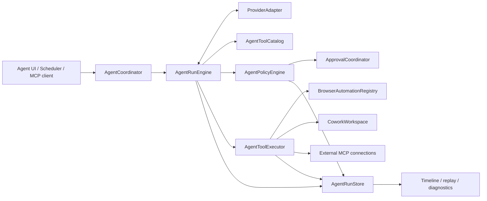
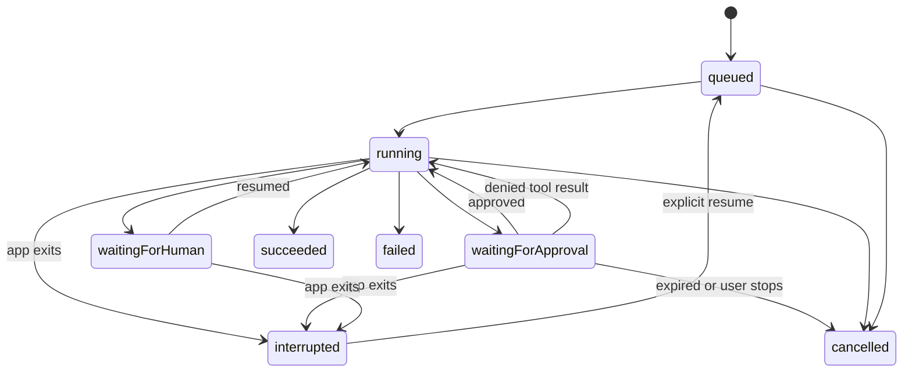

# AI tooling architecture

## Domain language

Use these names consistently in code, storage, UI, and protocol documentation:

| Name | Meaning | Must not mean |
|---|---|---|
| `BrowserSession` | Existing website-data isolation container: normal, persistent container, or incognito | An AI conversation, model request, or MCP connection |
| `Tab` | Existing browsing unit that owns a live or restorable WebKit page | A model message |
| `PageHandle` | Automation address for a Tab, currently `windowUUID:tabUUID` | A separate headless browser context |
| `AgentConversation` | User-visible thread containing prompts and run references | Browsing-data isolation |
| `AgentRun` | One bounded execution of a prompt | A long-lived conversation |
| `AgentStep` | One model response, tool invocation/result, approval, handoff, or system event | A raw UI message only |
| `AgentTaskDefinition` | Reusable scheduled prompt and execution policy | A particular scheduled run |
| `MCPConnection` | Configuration and trust state for one external MCP endpoint | A browser Session |
| `AgentRunGroup` | Parent execution coordinating bounded child runs | A TabGroup or Split |

A hidden or background Page remains a normal Tab. A Split remains per-window
view state. An AgentRun may address several Tabs, but it does not own their
website-data store.

## Target component boundaries



The boundaries are behavioral, not necessarily separate frameworks on day one.
They prevent four kinds of drift that exist in a monolithic loop: duplicate tool
schemas, entry-point-specific permission checks, provider-specific transcript
logic, and fragmented audit stores.

### `AgentCoordinator`

Creates conversations and runs, snapshots effective configuration, connects UI
or scheduler lifecycle to the engine, and resolves interrupted work after
relaunch. It does not execute JavaScript or interpret provider payloads.

### `AgentRunEngine`

Owns the bounded state machine and context window. It consumes normalized model
events, requests policy decisions before tools, records steps, and supports
cancellation. It knows only tool descriptors and the `AgentToolExecutor`
interface—not `WKWebView`, Keychain, SwiftUI, or a vendor JSON format.

### `ProviderAdapter`

Converts a normalized request into provider-specific network traffic and emits
an asynchronous stream of text deltas, tool-call deltas, usage, warnings, and a
terminal event. Adapters declare capabilities such as parallel tool calls,
image input, structured output, and usage reporting.

### `AgentToolCatalog`

Is the source of truth for stable tool name, semantic version, description,
input/output JSON Schemas, required static capabilities, risk class, origin,
and compatibility aliases. MCP `tools/list` and built-in model definitions are
renderings of the same descriptors.

The catalogue contains metadata only and must compile without AppKit, SwiftUI,
or WebKit so the app and `browser-cli` helper can share it.

### `AgentPolicyEngine`

Combines the tool's declared risk with invocation context: attended versus
scheduled, target origin, browser Session type, file path, external MCP server,
and whether data leaves the browser. It returns allow, deny, or require-human
approval. The executor cannot bypass it.

### `AgentToolExecutor`

Dispatches an approved invocation to one of three implementations:

- browser automation against `BrowserAutomationRegistry` and live Tabs;
- file operations within the selected Cowork root;
- dynamic tools through a specific trusted `MCPConnection`.

It returns structured content, artifacts, observations, and a normalized error.
It never manufactures an approval.

### `AgentRunStore`

Appends immutable steps and stores small mutable indexes separately. It powers
conversation history, recovery, replay, scheduler results, and diagnostic
export. Payload redaction happens before durable storage.

## Core contracts

The exact Swift types may evolve, but implementations should preserve these
shapes and separations:

```swift
struct AgentToolDescriptor: Codable, Sendable {
    let name: String
    let version: Int
    let inputSchema: JSONValue
    let outputSchema: JSONValue
    let requiredCapabilities: Set<AgentCapability>
    let risk: AgentToolRisk
    let origin: AgentToolOrigin
}

struct AgentToolInvocation: Codable, Sendable {
    let id: UUID
    let runID: UUID
    let toolName: String
    let arguments: JSONValue
    let context: AgentInvocationContext
}

enum AgentPolicyDecision: Codable, Sendable {
    case allow(reason: String)
    case deny(reason: String)
    case requireApproval(AgentApprovalRequest)
}

protocol AgentProviderAdapter: Sendable {
    var capabilities: AgentProviderCapabilities { get }
    func events(for request: AgentModelRequest) -> AsyncThrowingStream<AgentModelEvent, Error>
}
```

Do not use `[String: Any]` beyond protocol/network adapters. Convert to a
`Codable`, `Sendable` JSON value at the boundary so persistence, tests, and
concurrency share one representation.

## Run state machine



Terminal states are `succeeded`, `failed`, and `cancelled`. `interrupted` is
recoverable but never auto-resumes an attended run. Scheduled-run recovery
follows the task's catch-up policy and still re-evaluates permissions.

Each transition is an `AgentStep`. Store the reason, monotonic sequence number,
and wall-clock time. Never infer success solely because the last UI message was
not an error.

## Invocation lifecycle

1. The model proposes a named tool call.
2. The engine validates its name and arguments against the canonical schema.
3. The executor resolves targets without acting: PageHandle, origin, browser
   Session, Cowork path, or MCP connection.
4. The policy engine decides with that resolved context.
5. Approval is requested when necessary. Approval has a scope and expiry.
6. The executor acts once, with an idempotency key where the destination
   supports one.
7. A structured result and any replay/artifact references are appended.
8. A size-limited, redacted result is returned to the model.

Validation, denial, timeout, cancellation, and target disappearance all produce
tool results; they are not silent holes in the transcript.

## Persistence layout

Keep AI data beneath the app's Application Support directory and separate
mutable indexes from append-only run evidence:

```text
agent/
  conversations/index.json
  runs/<run-id>/metadata.json
  runs/<run-id>/steps.jsonl
  runs/<run-id>/frames/
  runs/<run-id>/artifacts/
  schedules.json
  connections.json
  memory/
```

Files containing content use owner-only permissions and complete file
protection where available. Keychain retains provider keys, bearer tokens, and
OAuth refresh tokens. The store should use atomic index replacement and
append-plus-fsync semantics for steps important to recovery.

Large content belongs in referenced artifacts, not inline in JSONL. Persist a
content type, byte count, SHA-256 digest, redaction state, and relative path.

## Concurrency rules

- SwiftUI state, `WKWebView`, and existing browser managers stay `@MainActor`.
- Provider transport, MCP transport, run persistence, and artifact hashing use
  actors or `Sendable` values off the main actor.
- A single run serializes its state transitions even if a provider proposes
  parallel tool calls.
- Browser mutation requires a Page lease. Multiple readers may observe a Page;
  only one run may mutate it at a time.
- Cancellation propagates from coordinator to provider request, pending
  approval, executor, and child runs.
- No actor may hold a Page lease while waiting for human approval.

## Migration sequence

1. Introduce the Foundation-only tool descriptor and generate both current
   schema formats without renaming any of the 53 MCP tools.
2. Add `AgentRunStore` and dual-write existing built-in and MCP audit events.
3. Move the current loop behind `AgentRunEngine`; retain the existing panel as
   its first client.
4. Add policy evaluation in report-only mode, compare decisions in tests, then
   make execution require an allow/approval result.
5. Switch replay and scheduler summaries to the unified store.
6. Remove legacy conversation and MCP audit files only after an importer and a
   user-visible retention/deletion path exist.

Compatibility is more important than a one-shot rewrite. Each step should ship
with the existing MCP tool names and CLI commands intact.
