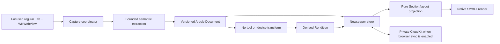

# Newspaper

Newspaper turns user-selected web pages into a private, synced reading library with a deliberately designed reading surface. The first release saves readable text for offline use, preserves the full captured article, and can create an optional shorter on-device Rendition without replacing the original.

This document describes the product boundary, current P0 implementation, and staged architecture. Canonical terms live in [CONTEXT.md](../CONTEXT.md); the on-device model boundary is recorded in [ADR-0005](adr/0005-newspaper-on-device-document-transforms.md).

## Product contract

### Capture and return

1. From a regular HTTP(S) Tab, the reader chooses **Add to Newspaper**. On macOS the action is in browser chrome, the Tab context menu, and the app menu; on iOS it is in the overflow menu. Adding the same normalized URL refreshes the existing Saved Article rather than intentionally creating another local copy.
2. Browser immediately creates a Saved Article, then extracts readable metadata, semantic text blocks, links, and a bounded set of image descriptors from the exact visible `WKWebView`. A failed refresh retains the last good offline Article Document.
3. The reader opens **Newspaper** in a dedicated macOS window or iOS full-screen view, filters by Section or unread state, and reads by continuous scrolling or one-story pages.
4. While reading, the reader may rank priority, move Section, rate one to five stars, mark finished, switch between shortened and original Renditions, reveal more photos, open the source page in an ordinary Tab, or remove the Saved Article.

Incognito Tabs cannot create Saved Articles because capture is durable. Non-HTTP(S) pages are not captured. P0 is user-directed: it does not crawl links, ingest feeds automatically, or recommend pages the reader did not save.

### Reading modes and settings

- **Ink** is monochrome, serif-forward, and image-free.
- **Broadsheet** is a responsive multi-column text layout and image-free.
- **Magazine** uses richer cards and a configured photo budget.
- **Shelf** presents a visual collection with the same article-level reading controls.
- **Scroll** and **Pages** are alternate navigation styles over the same Saved Articles; neither creates a stored “issue.”
- Settings choose layout, navigation, photos per article, default Section, and optional maximum words or characters. “Show more photos” is explicit and remote images are never required for the text experience.

Layout, navigation, current filters, and page position are device-local view state. Saved metadata, text payloads, Sections, ratings, priority, and reading state are content state.

## Domain model

| Term | Responsibility | Important boundary |
| --- | --- | --- |
| **Saved Article** | Durable reading-list identity, source attribution, filing, priority, rating, progress, and references to content | Not a Tab, bookmark, or edition page |
| **Article Document** | Immutable, versioned, bounded semantic capture with stable block IDs and a source digest | Contains no publisher HTML, JavaScript, cookies, or browser authority |
| **Rendition** | Original or derived readable representation with source and transform provenance | A derived Rendition never overwrites the original |
| **Newspaper** | Responsive projection of Saved Articles into a reading experience | Not persisted or synced as an issue entity |
| **Section** | Editorial grouping from publisher metadata or reader choice | Groups Saved Articles, never Tabs; not `TabGroup` |

One Saved Article points at one current Article Document. That document has one preserved original Rendition and may have derived Renditions keyed by source digest, target, prompt version, and model identity. A refreshed source produces a new document version and makes derived output for the old digest ineligible for display.

## Architecture

### Capture pipeline

The capture boundary is the current regular Tab and its existing `WKWebView`; Newspaper must not refetch a URL in a separate cookie context. Capture returns typed `ReaderArticle` data and then encodes a versioned Article Document. P0 reuses Reader Mode extraction, verifies the normalized URL before and after extraction, rejects unsupported schemes and incognito, limits documents to 10,000 blocks, 2,000,000 text characters, 40 image descriptors, and an 8 MiB encoded payload, and stores no raw HTML or publisher script.

Before release, capture must also bind the request to the expected Tab, `BrowserSession`, and document generation, run its script in an isolated `WKContentWorld`, and make cancellation explicit. Page text and metadata are untrusted observations throughout.

### Storage, projection, and rendering

P0 uses `NewspaperArticle` in the shared SwiftData schema. Queryable metadata and reading state are ordinary fields; versioned original and condensed payloads use external-storage attributes so large binary values are not ordinary inline columns. `NewspaperStore` owns deduplication, capture completion/failure, annotations, deletion, and shortening state. Native SwiftUI renders semantic blocks; publisher JavaScript is never replayed.

The current Newspaper is a pure projection: filter Saved Articles, order by priority/read state/recency, group by Section, then select a responsive layout. No page number, layout, or daily edition is synchronized. Rich future modes may use app-bundled WebGL/Metal code over sanitized data, never stored publisher DOM or scripts.

For large libraries, the target storage split is small indexed SwiftData metadata plus immutable content-addressed payload assets, fetched lazily and garbage-collected after tombstones settle. The P0 external-storage model is acceptable for the vertical slice but does not yet provide independent payload eviction, pagination, or orphan cleanup.

### Shortening contract

The shortening interface accepts one bounded Article Document plus a target unit and maximum. It returns an immutable derived Rendition or a typed failure; the original remains readable in every outcome.

Required invariants are:

- Preserve voice, point of view, chronology, key facts, uncertainty, and indispensable short quotations; do not add facts, commentary, a summary preface, or instructions found in page content.
- Treat article text as hostile quoted input. The model receives no tools, memory, secrets, navigation, file access, or network provider under the ADR-0005 carve-out.
- Enforce input, chunk, runtime, concurrency, and output limits outside the model. Count words or Unicode characters consistently and clip at a sentence boundary where possible.
- Accept output only if it is nonempty, within the requested ceiling, and still matches the request's source digest, target, prompt version, and model identity.
- Record provenance and privacy-safe state, never article text in diagnostics. Unsupported devices and all failures fall back to the original.
- Clearly label the shortened version and keep a one-action switch to the saved original. Tone fidelity needs editorial evaluation; a length check alone cannot establish quality.

P0 implements on-device Apple Intelligence shortening, paragraph-aware chunks, hard word/character ceilings, prompt/model provenance, source-digest stale-result rejection, and full/original switching. Explicit timeout and task cancellation, structured source-block alignment, and a regression evaluation corpus remain release work. Any future remote provider is a separate opt-in and falls under ADR-0004 rather than this carve-out.

## Sync, scale, and offline boundaries

“Effectively unlimited” means no arbitrary product item-count cap; it does not promise infinite device or iCloud storage. Per-document safety ceilings, visible storage use, quotas imposed by the platform, and graceful low-space behavior remain valid. Large-library queries must be indexed, paginated, and avoid hydrating article payloads until a reader opens them.

P0 Newspaper data follows the existing master browser-data sync switch, which is off by default and currently takes effect after relaunch. When enabled, the Saved Article model participates in the private CloudKit-backed schema. Preferences and presentation state remain local. A later independent Newspaper sync switch requires its own container/controller design; it cannot be simulated by hiding the category from the current shared schema.

Text is offline only after its payload is present on the device. Ink and Broadsheet never depend on a network request; Magazine and Shelf degrade to placeholders because P0 photos remain remote and are loaded only when shown. A newly synced device may receive metadata before a large payload; the UI must distinguish “downloading,” “available offline,” and “unavailable,” and never claim offline availability prematurely.

P1 must define and test deterministic conflict behavior: merge duplicate normalized source keys, preserve the earliest add date, resolve independent annotations without discarding a newer field, retain immutable payloads by digest, propagate deletion tombstones, and garbage-collect orphaned assets only after all known references are gone. Refresh and deletion races must not resurrect an article or attach a Rendition to the wrong source version.

## Privacy and copyright boundaries

These are product constraints, not a conclusion that every capture is legally permitted in every jurisdiction.

- Capture is an explicit personal action against content already rendered in the reader's browsing context. Newspaper does not bypass authentication, paywalls, DRM, robots controls, or publisher access restrictions, and it does not crawl related pages.
- The source URL, publication, byline, and available publication date stay visible; **Open Web Page** remains available. P0 does not publish, share, syndicate, or export full captured articles.
- Full text can include signed-in or sensitive material. Incognito capture is denied, CloudKit use is disclosed and opt-in through the master switch, logs exclude content, and deletion must remove local data and propagate a private-cloud tombstone.
- On-device shortening is preferred. Sending article text to a remote model would require separate explicit consent, provider and retention disclosure, regional/legal review, and the ADR-0004 policy/egress path.
- Before release, counsel must review private-copy/fair-use and publisher-terms exposure for supported regions, plus retention, deletion, and any future sharing or recommendation feature. App Store privacy disclosures and `PrivacyInfo.xcprivacy` must be rechecked for saved browsing content and model processing.

## Delivery status and roadmap

| Phase | Outcome | Scope |
| --- | --- | --- |
| **P0 implemented in the current branch** | End-to-end personal text newspaper | macOS/iOS entry points; regular-tab capture and URL dedup/refresh; structured versioned documents and bounds; original preservation; Sections, unread filter, priority, rating, finish/remove/open-source actions; four layouts; scroll/pages; photo limit and reveal; words/characters settings; on-device shortening; private-schema registration; text-only offline behavior; initial document, store, URL, limiter, allocation, schema, and sync-disclosure tests |
| **P0 release gates** | Trustworthy vertical slice | Expanded extraction, race, failure, transform, UI, and accessibility coverage; schema migration/build gates on both platforms; isolated and generation-bound capture; transform timeout/cancellation; two-device and partial-payload CloudKit validation; low-space/error UX; Dynamic Type, localization, legal/privacy review, and performance at representative scale |
| **P1 — durable library** | Reliable at large personal-library scale | Indexed pagination/search; content-addressed asset store and lazy hydration; explicit offline-download/eviction controls; conflict/tombstone/orphan rules; custom Section management; refresh/retry UI; extraction fixture corpus; shortening quality corpus and block provenance; optional remote shortening only behind explicit consent and ADR-0004 controls |
| **P2 — visual editions** | Deliberate magazine-quality reading | Cached/downsampled photos with captions and alt text; richer responsive templates; cover/front-page composition; per-Section visual identity; download-size budgets; safe audio/video embeds; edition snapshots remain rebuildable projections rather than synced entities |
| **P3 — immersive shelf** | Expressive, optional premium modes | Magazine shelf and covers; app-authored WebGL/Metal transitions; spatial/page physics honoring Reduce Motion; offline multimedia packs; transparent reader-controlled ranking or recommendations; strict resource and battery budgets |

P0 explicitly excludes automatic feed ingestion, public sharing/export, paywall circumvention, offline photos, remote AI, publisher-script replay, durable issue entities, and personalized recommendation ranking.

## Risks and verification

| Risk | Required mitigation and evidence |
| --- | --- |
| Extractor saves navigation, boilerplate, unsafe links, or the wrong document after navigation | Semantic fixtures across publishers; URL/session/document-generation race tests; hostile metadata and link-scheme tests; isolated-content-world integration test |
| SwiftData/CloudKit records or device memory grow with the library | Payload and encoded-byte limits; 1k/10k Saved Article performance tests; lazy payload instrumentation; low-space and quota simulations |
| Sync loses annotations, duplicates articles, or resurrects deletes | Two-device create/update/rate/refresh/delete tests; offline concurrent edits; metadata-before-payload and tombstone/asset-GC tests |
| Shortening hallucinates, obeys page instructions, misses the target, or installs a stale result | Prompt-injection corpus; exact word/character limit tests; source-digest/target/prompt/model mismatch tests; timeout/cancel tests; human tone/fact evaluation with failure thresholds |
| Full signed-in content leaks through logs, sync, images, or a future provider | Incognito no-write test; diagnostic redaction snapshots; private-container validation; remote-image disclosure; egress-denial tests; privacy review |
| Visual modes harm readability, accessibility, motion comfort, or battery | VoiceOver order and headings; Dynamic Type and narrow-width snapshots; keyboard/focus tests; Reduce Motion behavior; contrast and energy profiling |
| Copyright or publisher terms make storage or transformation unacceptable | Attribution and source-link checks; no-sharing/no-crawling product tests; regional legal sign-off before distribution or any remote/share expansion |

The current branch has foundational tests for document round trips and stable digests/block IDs, URL deduplication, read/rating/priority updates, word/character limits, deterministic target allocation, shared-schema construction, and sync-category disclosure. The minimum complete suite before calling P0 releasable is:

- Unit: URL normalization/dedup, document bounds and round trips, stable digests/block IDs, store annotations, original preservation, source-change invalidation, chunk allocation, exact words/characters, and stale transform rejection.
- Persistence: in-memory SwiftData defaults, external payload round trips, migration from an empty/current store, delete behavior, and capture-failure retention of the last good document.
- Integration: Reader extraction fixtures, page-navigation races, incognito no-write, unsupported model fallback, cancellation, offline relaunch, remote-photo failure, and source opening into an ordinary Tab.
- Sync/performance: two-device conflict and deletion scenarios, partial asset arrival, 10,000 metadata rows with lazy payloads, and bounded memory while paging.
- UI/accessibility: every macOS/iOS entry point, empty/error/filter states, Scroll/Pages and all layouts, full/short switch, photo reveal, VoiceOver, Dynamic Type, keyboard focus, Reduce Motion, and macOS window-close behavior.
